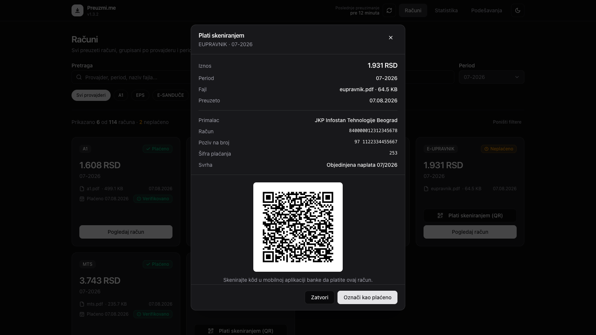
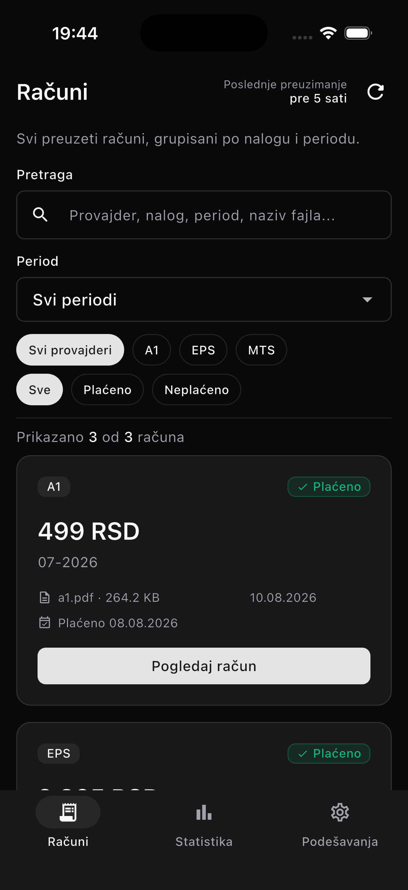
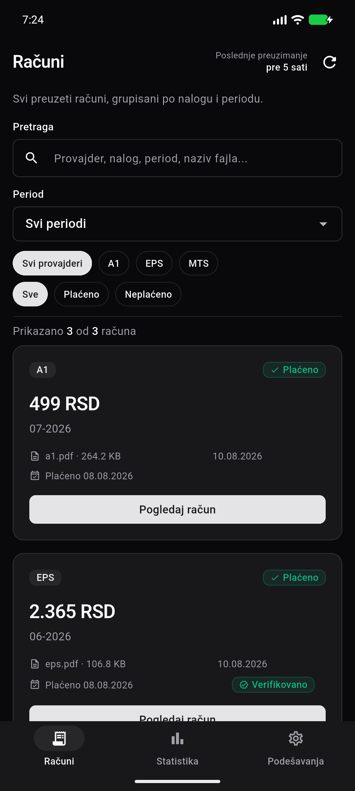
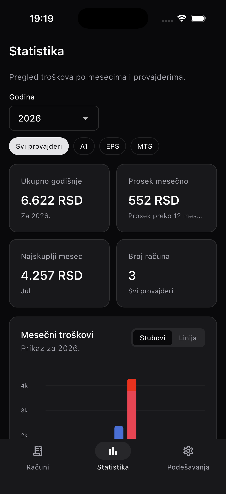
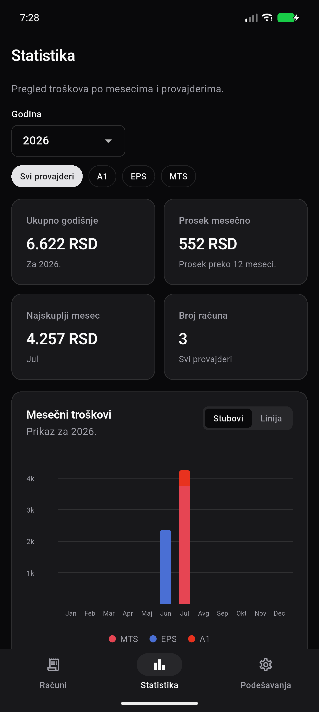
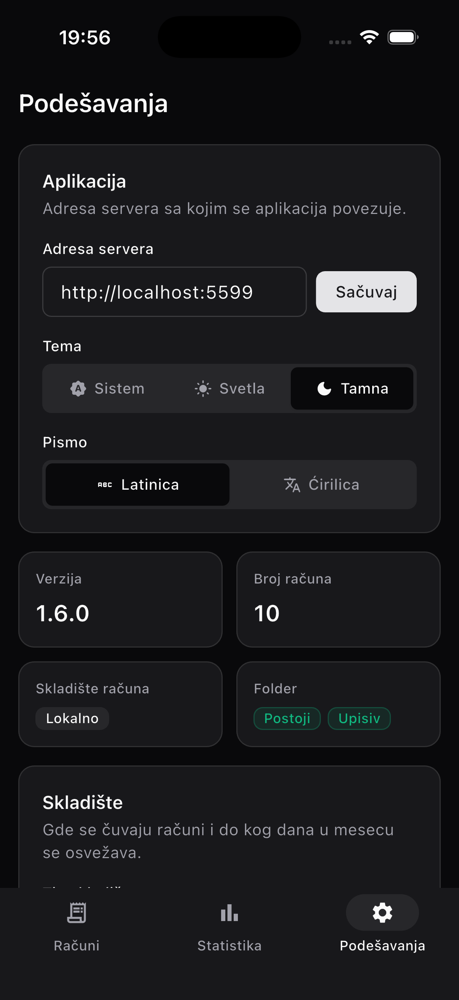
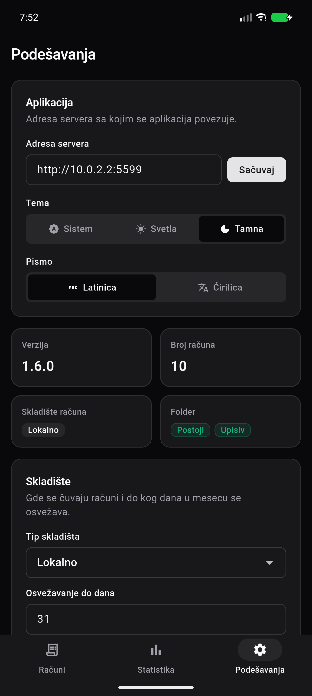
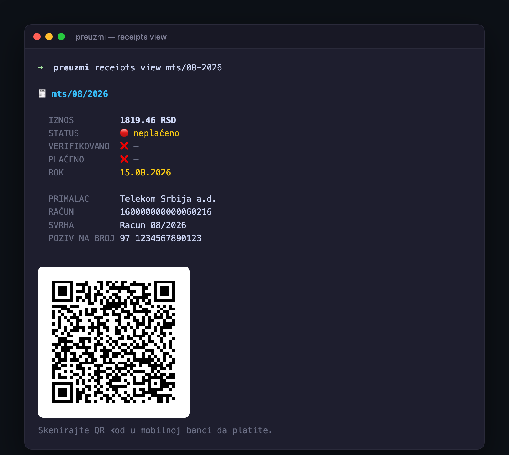

<p align="center">
  
</p>

<h1 align="center">Preuzmi.me</h1>

<p align="center">
  <strong>English</strong> · <a href="README.sr.md">Srpski</a>
</p>

<p align="center">
  <strong>Automatic receipt downloads</strong> for internet, phone, and electricity — in one place.<br/>
  An easy dashboard for tracking paid receipts and spending stats, so there are no more unintentionally unpaid bills.
</p>

<p align="center">
  <a href="#quick-start">Quick start</a> ·
  <a href="#features">Features</a> ·
  <a href="#screenshots">Screenshots</a> ·
  <a href="#configuration">Config</a> ·
  <a href="#cli">CLI</a> ·
  <a href="#run-from-source">From source</a>
</p>

<p align="center">
  <a href="https://github.com/CerealKiller97/preuzmi.me/actions/workflows/go-vet.yml"></a>
  <a href="https://github.com/CerealKiller97/preuzmi.me/actions/workflows/go-test.yml"></a>
  <a href="https://github.com/CerealKiller97/preuzmi.me/actions/workflows/govulncheck.yml"></a>
  <a href="https://github.com/CerealKiller97/preuzmi.me/actions/workflows/golangci-lint.yml"></a>
  <a href="https://github.com/CerealKiller97/preuzmi.me/actions/workflows/gosec.yml"></a>
</p>

<p align="center">
  
  
  
</p>

---

## Why

Every month: log into A1, mts, e.Sanduče… download PDFs… forget one… repeat.

**Preuzmi.me** does that for you. One refresh button (or a cron `checks` run), a clean UI for what landed, and charts for what you spent.

## Quick start

The quickest way to run Preuzmi.me is with Docker. The image is multi-arch and distroless — the SQL schema is embedded, so only `config.json` and a downloads folder need mounting.

First create a `config.json` (see [Configuration](#configuration)) with `"download_path": "/data/receipts"`.

### docker run

```bash
docker run -d --name preuzmi \
  -p 5500:5500 \
  -v "$PWD/config.json:/app/config.json:ro" \
  -v preuzmi-receipts:/data/receipts \
  ghcr.io/cerealkiller97/preuzmi.me:1.7.1
```

### docker compose

```yaml
services:
  preuzmi:
    image: ghcr.io/cerealkiller97/preuzmi.me:1.7.1
    container_name: preuzmi.me
    ports:
      - '5500:5500'
    volumes:
      - ./config.json:/app/config.json:ro
      - preuzmi-receipts:/data/receipts # or a bind mount: ./receipts:/data/receipts
    restart: unless-stopped

volumes:
  preuzmi-receipts:
```

```bash
docker compose up -d
```

Open `http://localhost:5500/dashboard` (port comes from `application.port`).

Run a download pass (same work as the header refresh button):

```bash
docker exec preuzmi /app/preuzmi checks
```

## Features

- **Multi-provider downloads** — A1, mts, EPS and e.Sanduče sign in with each provider's own platform credentials; Yettel and eUpravnik read the invoice from your mailbox over IMAP (for now)
- **Multiple accounts per provider** — add several logins for the same provider (e.g. family members), each with its own name; receipts are grouped and labelled per account, and notifications name the account ("EPS · Mama"). Solo setups stay exactly as they were
- **Smart refresh** — skips providers whose previous-month receipt is settled (`paid_at` set, status `plaćeno`, and `confirmed_at` set); unpaid or unverified bills keep running so status can flip
- **Receipt dashboard** — search, filter by period / provider / paid status
- **Paid tracking** — mark receipts paid from the UI or the `receipts` CLI; tracked as two separate moments: *paid by you* and *confirmed by the provider*
- **Payment QR** — unpaid receipt cards show *Plati skeniranjem (QR)*: the bill's own NBS IPS QR, lifted straight from the PDF and shown in a modal to scan in your banking app. The amount is read from that QR, so what you see matches what the bank charges
- **Stats** — yearly totals, monthly averages, per-provider charts
- **Notifications** — Telegram or SMTP (`off` / `per_receipt` / `all_done`)
- **Due-date tracking & reminders** — unpaid cards show an *overdue* / *due-soon* badge and the deadline; opt into `notifications.due_reminders` for a message listing every bill due within `notifications.due_reminder_days` (default 7)
- **Storage** — local folder or S3-compatible bucket
- **Live settings** — edit `config.json` from the UI; hot-reload without restart
- **`check_until`** — skip wasted refreshes after the day providers stop issuing bills
- **Serbian script** — pick Latin (default) or Cyrillic via the `lang` key; applies to the UI, `receipts` CLI, and notifications

## Screenshots

### Receipts

<p align="center">
  
</p>

### Payment QR

<p align="center">
  
</p>

### Statistics

<p align="center">
  
</p>

### Settings

<p align="center">
  
</p>

### Mobile (iOS & Android)

The Flutter app ([`apps/mobile`](apps/mobile)) mirrors the web UI on both platforms — iOS on the left, Android on the right.

<p align="center">
  
  
</p>

<p align="center">
  
  
</p>

<p align="center">
  
  
</p>

## Configuration

`config.json` lives next to the binary / working directory. Secrets are never echoed back by the settings API; leave password fields empty in the UI to keep the current value.

```json
{
  "application": {
    "host": "0.0.0.0",
    "port": 5500
  },
  "storage": "local",
  "download_path": "./receipts",
  "check_until": 20,
  "lang": "latin",
  "notifications": {
    "mode": "off",
    "driver": "telegram",
    "due_reminders": false,
    "due_reminder_days": 7,
    "smtp": {
      "host": "smtp.example.com",
      "port": 587,
      "username": "",
      "password": "",
      "from": "",
      "to": ""
    },
    "telegram": {
      "bot_token": "",
      "chat_id": ""
    }
  },
  "log_level": "info",
  "pretty_print": true,
  "email": {
    "provider": "gmail",
    "mailbox": "INBOX"
  },
  "providers": {
    "a1": { "identifier": "", "password": "" },
    "mts": { "identifier": "", "password": "" },
    "esanduce": { "identifier": "", "password": "" },
    "eps": { "identifier": "", "password": "" },
    "yettel": { "identifier": "you@gmail.com", "password": "gmail-app-password", "mailbox": "Racuni/Yettel" },
    "eupravnik": { "identifier": "you@gmail.com", "password": "gmail-app-password", "mailbox": "Racuni/Eupravnik" }
  }
}
```

| Key                        | Notes                                                                                                                                                              |
| -------------------------- | ------------------------------------------------------------------------------------------------------------------------------------------------------------------ |
| `storage`                  | `local` or `s3`                                                                                                                                                    |
| `download_path`            | Where PDFs + `meta.json` / `receipts.db` / `refresh.json` live. In Docker use an in-container path (e.g. `/data/receipts`) and bind-mount the host folder there. |
| `check_until`              | Last calendar day of the month refresh is allowed (default `20`)                                                                                                   |
| `lang`                     | UI and notification script: `latin` (default) or `cyrillic`                                                                                                        |
| `notifications.mode`       | `off` · `per_receipt` · `all_done`                                                                                                                                 |
| `notifications.driver`     | `telegram` or `smtp`                                                                                                                                               |
| `notifications.telegram.bot_token` | Telegram bot token. In Telegram, open **@BotFather**, send `/newbot`, pick a name and username — BotFather returns the token.                              |
| `notifications.telegram.chat_id`   | ID of the chat notifications are sent to. Message your bot, then open `https://api.telegram.org/bot<TOKEN>/getUpdates` and read `chat.id`. For a personal chat, **@userinfobot** also works. |
| `notifications.due_reminders`     | Send a reminder for unpaid receipts that are overdue or due soon — `true` / `false` (default `false`)                                                       |
| `notifications.due_reminder_days` | How many days before the deadline reminders start (default `7`)                                                                                             |
| `email.provider`           | Mailbox driver for the email-based providers (eUpravnik / Yettel). **Currently `gmail` only.**                                                                     |
| `providers.<name>.mailbox` | Gmail label to search for that provider's invoice. Empty → falls back to `email.mailbox`, then `INBOX`.                                                            |

### Providers

The **Portal** is where a person signs in; **Login** is how Preuzmi.me actually pulls the invoice — either the provider's own platform or your mailbox over IMAP.

| Provider | Portal | Login |
| --- | --- | --- |
| **A1** | [asmp.a1.rs](https://asmp.a1.rs) | Platform |
| **mts** | [moj.mts.rs](https://moj.mts.rs) | Platform |
| **EPS** | [portal.eps.rs](https://portal.eps.rs) | Platform |
| **e.Sanduče** | [esanduce.rs](https://esanduce.rs) | Platform |
| **eUpravnik** | [moj.e-upravnik.rs](https://moj.e-upravnik.rs) | Mailbox (IMAP) — invoice arrives by email |
| **Yettel** | — (invoice arrives by email) | Mailbox (IMAP) |

> **Two login models.** **A1, mts, EPS and e.Sanduče** authenticate against each service's own platform, so their `identifier` / `password` are your **login for that provider**. **Yettel and eUpravnik** have no usable API, so — _for now_ — the app reads the invoice PDF from your mailbox over IMAP; their `identifier` / `password` are your **Gmail address and a Google App Password**, not the provider login. See [eUpravnik & Yettel](#eupravnik--yettel--mailbox-based-gmail-only-for-now) below.

Host / port are **frozen while the process is running** — change them in `config.json` and restart. Everything else can be applied from **Settings → Apply changes**.

### eUpravnik & Yettel — mailbox-based (Gmail only, for now)

Unlike A1 / mts / EPS / e.Sanduče, which sign in to the provider's own platform, **eUpravnik and Yettel do not use platform credentials.** Neither exposes a usable API, so the app reads the invoice PDF **straight from your mailbox over IMAP**.

- **Gmail is currently the only driver** (`email.provider: "gmail"`).
- For these two providers, `identifier` / `password` are your **Gmail address and a Google [App Password](https://support.google.com/accounts/answer/185833)** — _not_ your eUpravnik / Yettel login.
- `providers.<name>.mailbox` is the Gmail **label** to search (e.g. `Racuni/Yettel`); nested labels use `/`. Empty falls back to `email.mailbox`, then `INBOX`.

#### Faster lookups with Gmail labels

Left empty, `mailbox` searches your whole `INBOX` on every refresh — slow on a large mailbox, and likelier to match the wrong PDF. Give each email provider its own Gmail label and point `mailbox` at it, so the IMAP search scans only that label. On Gmail every label _is_ an IMAP folder, so the app can select it directly.

1. **Create the label** — Gmail → _Settings_ ⚙ → _See all settings_ → _Labels_ → _Create new label_. Use a nested name like `Racuni/Yettel` (the `/` nests it under `Racuni`).
2. **Filter incoming invoices into it** — Gmail search bar → _Show search options_ → match the invoice mail (e.g. `from:(no-reply@yettel.rs)` or a subject term) → _Create filter_ → tick _Apply the label_ and choose it. Tick _Also apply to matching conversations_ to backfill existing mail.
3. **Enable IMAP on the label** — back on the _Labels_ screen, find the label and tick _Show in IMAP_. Without this the app can't open it over IMAP.
4. **Point the config at it** — set the provider's `mailbox` to the exact label path: `"mailbox": "Racuni/Yettel"`.

Resolution order is `providers.<name>.mailbox` → `email.mailbox` → `INBOX`: a per-provider label overrides the shared `email.mailbox`, and an unset value falls back to it (then `INBOX`).

## Run from source

Prefer to run it without Docker? You'll need:

- Go **1.26+**
- Node **18+** (only to build CSS once)
- A `config.json` in the project root (see [Configuration](#configuration))

```bash
git clone https://github.com/CerealKiller97/preuzmi.me.git
cd preuzmi.me/apps/server

# CSS bundle (once, or after style changes)
npm install
npm run build

# Copy / edit config, then:
go run . serve
```

> The Go server now lives under [`apps/server`](apps/server) (see [Project layout](#project-layout)); run every `go` / `task` / `npm` command from there.

Open `http://localhost:5500/dashboard`, then run a download pass:

```bash
go run . checks
# or click the refresh button in the header
```

## CLI

```text
preuzmi.me serve      Start the HTTP UI + API
preuzmi.me checks     Download receipts from every configured provider
preuzmi.me receipts   List and update receipts from the terminal
preuzmi.me help       Show usage
```

`checks` is the same work as the header refresh button. Ideal for cron (see [Scheduling](#scheduling-cron)).

### `receipts`

Browse and update receipts without opening the dashboard — it reads and writes the same receipts database, so the terminal and the UI stay in sync.

```text
preuzmi.me receipts list [MM/YYYY]        List a period's receipts (defaults to the previous month)
preuzmi.me receipts view <key>            Show a receipt's details and its payment QR
preuzmi.me receipts mark:as-paid   <key>  Mark a receipt paid (key is PROVIDER/PERIOD, e.g. eps/06-2026)
preuzmi.me receipts mark:as-unpaid <key>  Clear the paid mark
```

<p align="center">
  
</p>

`list` shows a **STATUS** (as the provider reports it) plus two timestamps: **VERIFIKOVANO** — when the provider confirmed the payment — and **PLAĆENO** — when you marked it paid yourself.

> **When is a receipt considered paid?** When the **provider confirms** it — i.e. STATUS is `plaćeno` / VERIFIKOVANO is set. STATUS and VERIFIKOVANO are the same signal (VERIFIKOVANO is just the date STATUS became `plaćeno`), so they always agree. **PLAĆENO** is your own record that you've sent the payment and is independent of the provider — a receipt can be PLAĆENO but not yet VERIFIKOVANO (as with `eps` above: paid by you, awaiting the provider's confirmation).

Colour and box drawing are auto-disabled when output isn't a terminal; it respects `NO_COLOR`, and `FORCE_COLOR` forces colour when piping.

#### `receipts view <key>`

`receipts view` shows a single bill's details and its NBS IPS **payment QR** right in the terminal, so you can scan and pay without opening the dashboard. Alongside the amount, status and dates it prints the payment fields the QR carries — recipient, account, purpose and reference (`PRIMALAC` / `RAČUN` / `SVRHA` / `POZIV NA BROJ`).

<p align="center">
  
</p>

The display is **auto-detected** so the code always reaches your screen: an inline image on terminals that support it (iTerm2, Warp), the PNG opened in your image viewer on a local desktop session, or a text QR on a remote / headless shell (SSH, RPi Connect …). The image modes reuse the exact PNG the dashboard serves, which scans reliably. Force a specific mode with the `PREUZMI_QR` environment variable — `inline` · `image` · `path` · `blocks` · `braille`.

## Scheduling (cron)

**The Docker image checks for receipts automatically** — a `crond` baked into the image runs `checks` **every day at 10:00** (container local time), so bills download with no host setup. The app's `check_until` (default `20`) decides whether a given day actually downloads, so `check_until` stays the single source of truth for the window.

- **Timezone** defaults to `Europe/Belgrade` (so 10:00 and the `check_until` day are Belgrade time). Override with `TZ` — `-e TZ=Europe/Ljubljana`, or `environment: [TZ=…]` in compose.
- **Change the time** by mounting your own crontab over `/etc/crontabs/root`.
- **Run it now**, anytime: `docker exec preuzmi /app/preuzmi checks`.

Running from source instead? Schedule it from the host's crontab — `check_until` still gates the window from inside the app:

```cron
# every day at 10:00
0 10 * * *  cd /path/to/preuzmi.me && ./preuzmi.me checks
```

## Project layout

The repo is a monorepo: the Go web server and the Flutter mobile client are
sibling apps under `apps/`.

```text
apps/server/                 Go web app + JSON API (run go/task/npm from here)
  assets/                    CSS, JS, favicons, Open Graph art
  pkg/config                 Load / validate / atomic save
  pkg/container              DI + hot reload
  pkg/http                   Dashboard, stats, settings, APIs
  pkg/services/*             Providers, storage, refresh, notify, payments
  templates/                 HTML (Alpine-driven)
apps/mobile/                 Flutter app (iOS + Android) — same UI, consumes the JSON API
docs/screenshots            README UI captures
```

## Mobile app

[`apps/mobile`](apps/mobile) is a Flutter client that mirrors the web UI
(Receipts, Stats, Settings) and talks to a running server over its JSON API.
Point it at your server from **Settings → Server URL** (default
`http://localhost:5500`; Android emulator uses `http://10.0.2.2:5500`).

```bash
cd apps/mobile
flutter pub get
flutter run
```

Production builds (output to `apps/mobile/dist/`, see [scripts/README](apps/mobile/scripts/README.md)):

```bash
cd apps/mobile
scripts/build-apk.sh            # release APK
scripts/build-ipa.sh            # unsigned release IPA (SIGNED=1 for a signed one)
```

## Open Graph

Social previews use [`assets/img/og.png`](assets/img/og.png) (1200×630). Source SVG: [`assets/img/og.svg`](assets/img/og.svg).

## License

Copyright © 2025–2026 Stefan Bogdanović
Licensed under the terms of the **GNU Affero General Public License v3 only**.
