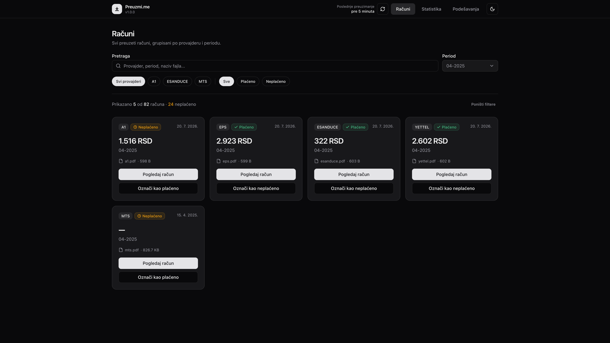
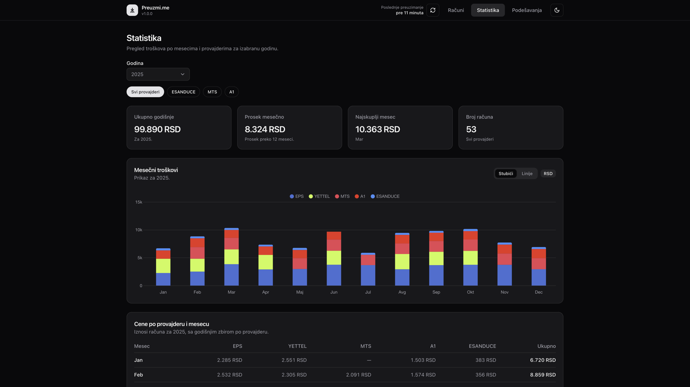
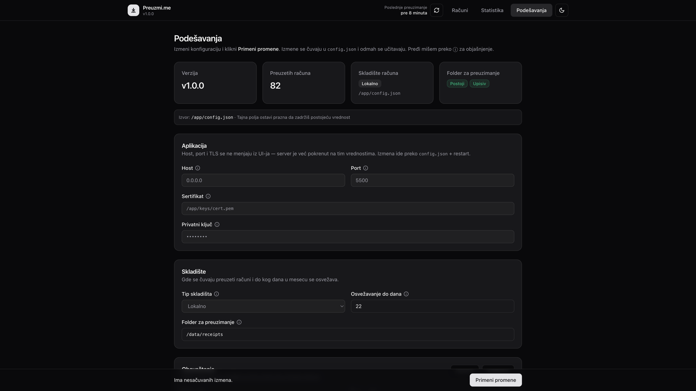
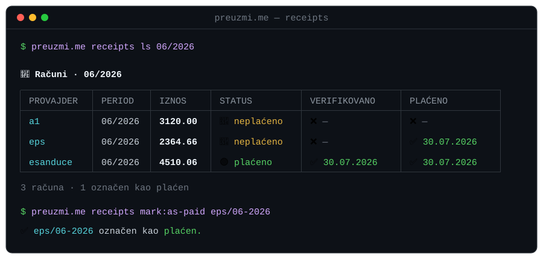

<p align="center">
  
</p>

<h1 align="center">Preuzmi.me</h1>

<p align="center">
  <a href="README.md">English</a> · <strong>Srpski</strong>
</p>

<p align="center">
  <strong>Automatsko preuzimanje računa</strong> za internet, telefon i struju — na jednom mestu.<br/>
  Jednostavan dashboard za praćenje plaćenih računa i statistike troškova, da nijedan račun ne promakne neplaćen.
</p>

<p align="center">
  <a href="#brzi-start">Brzi start</a> ·
  <a href="#mogucnosti">Mogućnosti</a> ·
  <a href="#snimci-ekrana">Snimci ekrana</a> ·
  <a href="#konfiguracija">Konfiguracija</a> ·
  <a href="#cli">CLI</a> ·
  <a href="#pokretanje-iz-koda">Iz koda</a>
</p>

<p align="center">
  <a href="https://github.com/CerealKiller97/preuzmi.me/actions/workflows/go-vet.yml"></a>
  <a href="https://github.com/CerealKiller97/preuzmi.me/actions/workflows/go-test.yml"></a>
  <a href="https://github.com/CerealKiller97/preuzmi.me/actions/workflows/govulncheck.yml"></a>
  <a href="https://github.com/CerealKiller97/preuzmi.me/actions/workflows/golangci-lint.yml"></a>
  <a href="https://github.com/CerealKiller97/preuzmi.me/actions/workflows/gosec.yml"></a>
</p>

<p align="center">
  
  
  
</p>

---

## Zašto

Svaki mesec: uloguj se na A1, mts, e.Sanduče… preuzmi PDF… zaboravi jedan… ponovi.

**Preuzmi.me** to radi umesto tebe. Jedno dugme za osvežavanje (ili cron `checks`), pregled šta je stiglo i grafikoni koliko si potrošio.

## Brzi start

Najlakši način da pokreneš Preuzmi.me je preko Docker-a. Image je multi-arch i distroless — SQL šema je ugrađena, pa treba mapirati samo `config.json` i folder za preuzimanja.

Prvo napravi `config.json` (vidi [Konfiguracija](#konfiguracija)) sa `"download_path": "/data/receipts"`.

### docker run

```bash
docker run -d --name preuzmi \
  -p 5500:5500 \
  -v "$PWD/config.json:/app/config.json:ro" \
  -v preuzmi-receipts:/data/receipts \
  ghcr.io/cerealkiller97/preuzmi.me:1.0.2
```

### docker compose

```yaml
services:
  preuzmi:
    image: ghcr.io/cerealkiller97/preuzmi.me:1.0.2
    container_name: preuzmi.me
    ports:
      - "5500:5500"
    volumes:
      - ./config.json:/app/config.json:ro
      - preuzmi-receipts:/data/receipts   # ili bind mount: ./receipts:/data/receipts
    restart: unless-stopped

volumes:
  preuzmi-receipts:
```

```bash
docker compose up -d
```

Otvori `http://localhost:5500/dashboard` (port je `application.port`).

Pokreni preuzimanje (isti posao kao dugme za osvežavanje):

```bash
docker exec preuzmi /app/preuzmi checks
```

## Mogućnosti

- **Više provajdera** — A1, mts, EPS i e.Sanduče se prijavljuju kredencijalima svoje platforme; Yettel i eUpravnik čitaju račun iz vašeg sandučeta preko IMAP-a (za sada)
- **Dashboard računa** — pretraga, filter po periodu / provajderu / statusu plaćanja
- **Praćenje plaćanja** — označi račun kao plaćen iz UI-ja ili `receipts` CLI-ja; prati se kao dva odvojena trenutka: *ti platio* i *provajder potvrdio*
- **Statistika** — godišnji zbir, mesečni prosek, grafikoni po provajderu
- **Obaveštenja** — Telegram ili SMTP (`off` / `per_receipt` / `all_done`)
- **Skladište** — lokalni folder ili S3-kompatibilni bucket
- **Živa podešavanja** — izmena `config.json` iz UI-ja; hot-reload bez restarta
- **`check_until`** — bez bespotrebnog osvežavanja posle dana kada provajderi više ne izdaju račune

## Snimci ekrana

### Računi

<p align="center">
  
</p>

### Statistika

<p align="center">
  
</p>

### Podešavanja

<p align="center">
  
</p>

## Konfiguracija

`config.json` stoji pored binarnog fajla / u radnom direktorijumu. Tajne vrednosti API nikad ne vraća; u UI ostavi polja za lozinku prazna da zadržiš postojeću vrednost.

```json
{
  "application": {
    "host": "0.0.0.0",
    "port": 5500
  },
  "storage": "local",
  "download_path": "./receipts",
  "check_until": 20,
  "notifications": {
    "mode": "off",
    "driver": "telegram",
    "smtp": {
      "host": "smtp.example.com",
      "port": 587,
      "username": "",
      "password": "",
      "from": "",
      "to": ""
    },
    "telegram": {
      "bot_token": "",
      "chat_id": ""
    }
  },
  "log_level": "info",
  "pretty_print": true,
  "email": {
    "provider": "gmail",
    "mailbox": "INBOX"
  },
  "providers": {
    "a1":        { "identifier": "", "password": "" },
    "mts":       { "identifier": "", "password": "" },
    "esanduce":  { "identifier": "", "password": "" },
    "eps":       { "identifier": "", "password": "" },
    "yettel":    { "identifier": "you@gmail.com", "password": "gmail-app-password", "mailbox": "Racuni/Yettel" },
    "eupravnik": { "identifier": "you@gmail.com", "password": "gmail-app-password", "mailbox": "Racuni/Eupravnik" }
  }
}
```

| Ključ | Napomena |
| --- | --- |
| `storage` | `local` ili `s3` |
| `download_path` | Gde idu PDF-ovi + `meta.json` / `receipts.db` / `refresh.json`. U Dockeru koristi putanju unutar kontejnera (npr. `/data/receipts`) i mapiraj host folder tamo. |
| `check_until` | Poslednji dan u mesecu kada je osvežavanje dozvoljeno (podrazumevano `20`) |
| `notifications.mode` | `off` · `per_receipt` · `all_done` |
| `notifications.driver` | `telegram` ili `smtp` |
| `email.provider` | Drajver sandučeta za email provajdere (eUpravnik / Yettel). **Trenutno samo `gmail`.** |
| `providers.<ime>.mailbox` | Gmail labela koja se pretražuje za račun tog provajdera. Prazno → pada na `email.mailbox`, pa na `INBOX`. |

> **Dva načina prijave.** **A1, mts, EPS i e.Sanduče** se autentifikuju na sopstvenu platformu, pa su njihovi `identifier` / `password` vaša **prijava za tog provajdera**. **Yettel i eUpravnik** nemaju upotrebljiv API, pa — *za sada* — aplikacija čita PDF računa iz vašeg sandučeta preko IMAP-a; njihovi `identifier` / `password` su vaša **Gmail adresa i Google App Password**, a ne prijava za provajdera. Vidi [eUpravnik & Yettel](#eupravnik--yettel--preko-sandučeta-za-sada-samo-gmail) niže.

Host / port su **zaključani dok proces radi** — menjaju se u `config.json` + restart. Sve ostalo ide preko **Podešavanja → Primeni promene**.

### eUpravnik & Yettel — preko sandučeta (za sada samo Gmail)

Za razliku od A1 / mts / EPS / e.Sanduče, koji se prijavljuju na platformu provajdera, **eUpravnik i Yettel ne koriste kredencijale platforme.** Nijedan nema upotrebljiv API, pa aplikacija čita PDF računa **direktno iz vašeg sandučeta preko IMAP-a**.

- **Trenutno je Gmail jedini drajver** (`email.provider: "gmail"`).
- Za ova dva provajdera, `identifier` / `password` su vaša **Gmail adresa i Google [App Password](https://support.google.com/accounts/answer/185833)** — a *ne* prijava za eUpravnik / Yettel.
- `providers.<ime>.mailbox` je Gmail **labela** koja se pretražuje (npr. `Racuni/Yettel`); ugnežđene labele koriste `/`. Prazno pada na `email.mailbox`, pa na `INBOX`.

#### Brža pretraga uz Gmail labele

Kada je prazno, `mailbox` na svakom osvežavanju pretražuje ceo `INBOX` — sporo na velikom sandučetu i sa većom šansom da pogodi pogrešan PDF. Dajte svakom email provajderu svoju Gmail labelu i usmerite `mailbox` na nju, da IMAP pretraga skenira samo tu labelu. Na Gmail-u je svaka labela ujedno i IMAP folder, pa aplikacija može direktno da je otvori.

1. **Napravite labelu** — Gmail → *Podešavanja* ⚙ → *Prikaži sva podešavanja* → *Labele* → *Napravi novu labelu*. Koristite ugnežđeno ime kao `Racuni/Yettel` (`/` je ugnežđuje pod `Racuni`).
2. **Filtrirajte dolazne račune u nju** — Gmail pretraga → *Prikaži opcije pretrage* → uparite mejl sa računom (npr. `from:(no-reply@yettel.rs)` ili termin iz naslova) → *Napravi filter* → čekirajte *Primeni labelu* i izaberite je. Čekirajte *Primeni i na postojeće razgovore* da obuhvatite već pristigle mejlove.
3. **Uključite IMAP na labeli** — na ekranu *Labele* nađite labelu i čekirajte *Prikaži u IMAP-u* (*Show in IMAP*). Bez toga aplikacija ne može da je otvori preko IMAP-a.
4. **Usmerite config na nju** — postavite `mailbox` provajdera na tačnu putanju labele: `"mailbox": "Racuni/Yettel"`.

Redosled razrešavanja je `providers.<ime>.mailbox` → `email.mailbox` → `INBOX`: labela po provajderu ima prednost nad zajedničkim `email.mailbox`, a prazna vrednost pada na njega (pa na `INBOX`).

## Pokretanje iz koda

Više voliš bez Docker-a? Treba ti:

- Go **1.26+**
- Node **18+** (samo za jednokratni build CSS-a)
- `config.json` u korenu projekta (vidi [Konfiguracija](#konfiguracija))

```bash
git clone https://github.com/CerealKiller97/preuzmi.me.git
cd preuzmi.me

# CSS bundle (jednom, ili posle izmene stilova)
npm install
npm run build

# Kopiraj / izmeni config, zatim:
go run . serve
```

Otvori `http://localhost:5500/dashboard`, zatim pokreni preuzimanje:

```bash
go run . checks
# ili klikni dugme za osvežavanje u headeru
```

## CLI

```text
preuzmi.me serve      Pokreće HTTP UI + API
preuzmi.me checks     Preuzima račune sa svih podešenih provajdera
preuzmi.me receipts   Pregled i izmena računa iz terminala
preuzmi.me help       Prikazuje pomoć
```

`checks` radi isto što i dugme za osvežavanje u headeru. Pogodno za cron (vidi [Zakazivanje](#zakazivanje-cron)).

### `receipts`

Pregledaj i menjaj račune bez otvaranja dashboard-a — čita i piše u istu bazu računa, pa su terminal i UI uvek usklađeni.

```text
preuzmi.me receipts list [MM/YYYY]        Ispiši račune za period (podrazumevano prethodni mesec)
preuzmi.me receipts mark:as-paid   <key>  Označi račun kao plaćen (ključ je PROVAJDER/PERIOD, npr. eps/06-2026)
preuzmi.me receipts mark:as-unpaid <key>  Ukloni oznaku plaćeno
```

<p align="center">
  
</p>

`list` prikazuje dva nezavisna vremena po računu: **VERIFIKOVANO** — kada je provajder potvrdio uplatu — i **PLAĆENO** — kada si ti označio račun kao plaćen. Boje i okvir se automatski isključuju kada izlaz nije terminal; poštuje `NO_COLOR`, a `FORCE_COLOR` forsira boje pri prosleđivanju kroz pipe.

## Zakazivanje (cron)

**Docker image automatski proverava račune** — ugrađeni `crond` pokreće `checks` **svaki dan u 10:00** (lokalno vreme kontejnera), pa se računi preuzimaju bez ikakvog podešavanja na hostu. `check_until` (podrazumevano `20`) odlučuje da li se tog dana zaista preuzima, pa `check_until` ostaje jedini izvor istine za period.

- **Vremenska zona** je podrazumevano `Europe/Belgrade` (pa su 10:00 i dan iz `check_until` po beogradskom vremenu). Promeni preko `TZ` — `-e TZ=Europe/Ljubljana`, ili `environment: [TZ=…]` u compose-u.
- **Promeni vreme** montiranjem svog crontab-a preko `/etc/crontabs/root`.
- **Pokreni odmah**, kad god želiš: `docker exec preuzmi /app/preuzmi checks`.

Pokrećeš iz koda? Zakaži iz host crontab-a — `check_until` i dalje ograničava period iznutra:

```cron
# svaki dan u 10:00
0 10 * * *  cd /putanja/do/preuzmi.me && ./preuzmi.me checks
```

## Struktura projekta

```text
assets/          CSS, JS, favikone, Open Graph
docs/screenshots snimci ekrana za README
pkg/config       učitavanje / validacija / atomski save
pkg/container    DI + hot reload
pkg/http         dashboard, statistika, podešavanja, API
pkg/services/*   provajderi, skladište, refresh, notify, payments
templates/       HTML (Alpine)
```

## Open Graph

Za deljenje linkova koristi se [`assets/img/og.png`](assets/img/og.png) (1200×630). Izvor: [`assets/img/og.svg`](assets/img/og.svg).

## Licenca

Copyright © 2025–2026 Stefan Bogdanović  
Licencirano pod uslovima **GNU Affero General Public License v3 only**.
